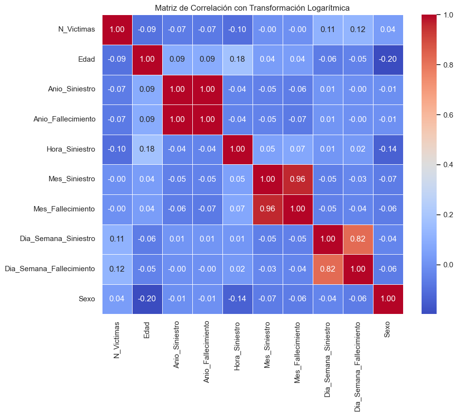
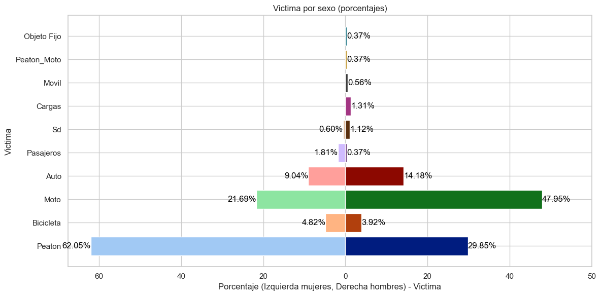
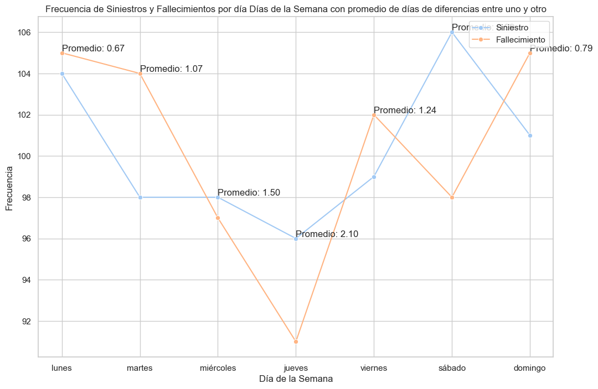
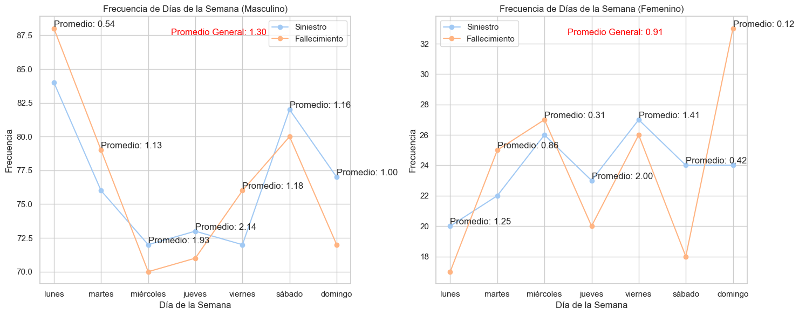
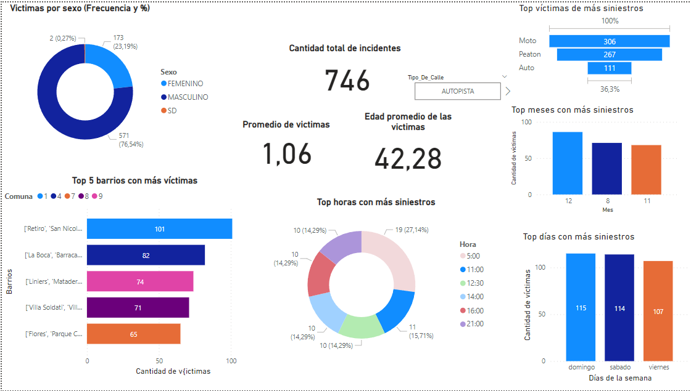
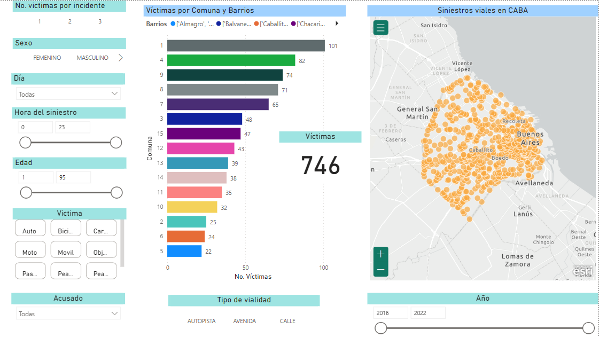
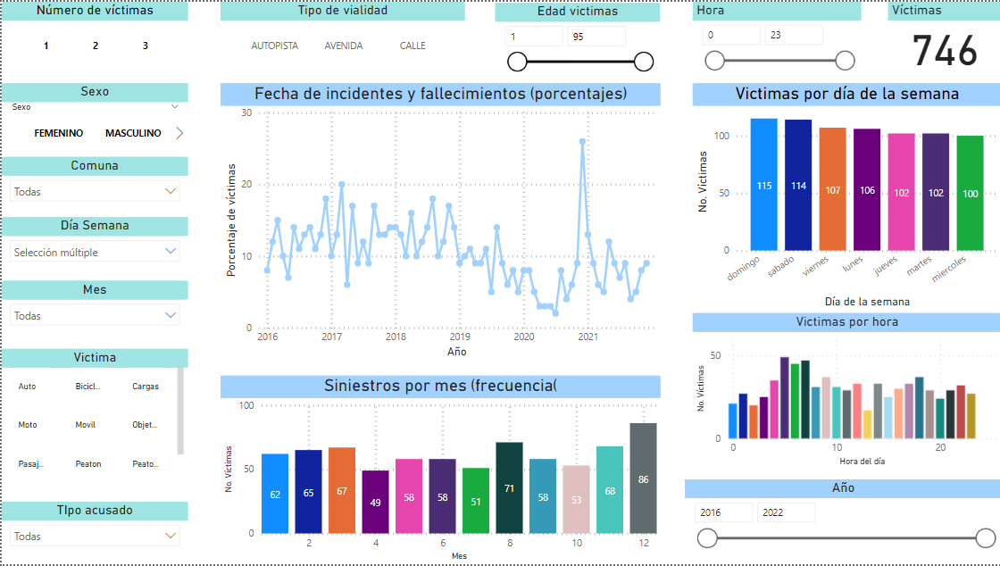
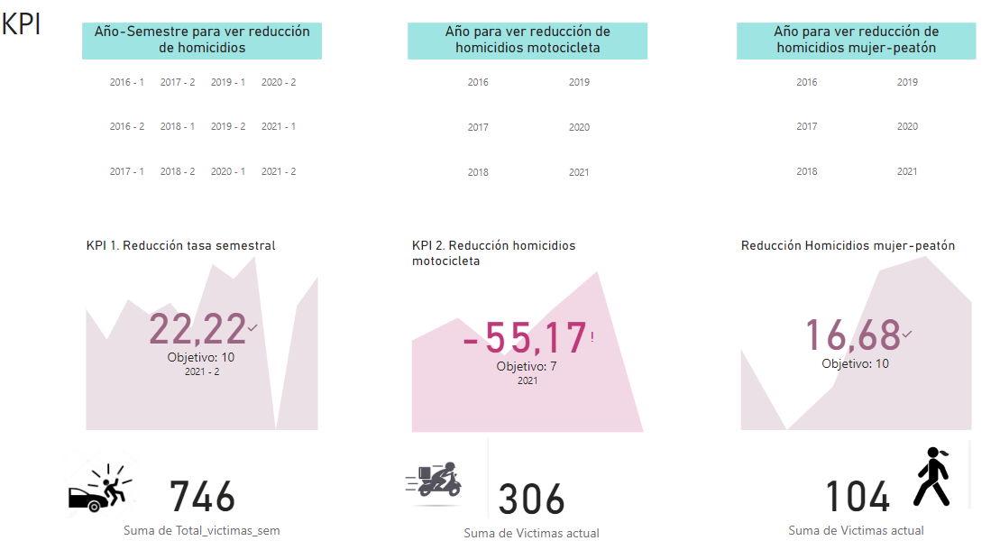

# PI2-Siniestros-Edupechav
 Proyecto individual No. 2. Para bootcamp Soy Henry. Ft17

# Análisis de siniestros viales en CABA
En este proyecto se simula el rol de un analista de datos con el fin de analizar los accidentes de tránsito con víctimas fatales en la Ciudad de Buenos Aires (CABA) entre 2016 y 2021. El proyecto simula ser realizado para el Observatorio de Movilidad y Seguridad Vial, que opera como parte de la Secretaría de Transporte del Gobierno de la Ciudad Autónoma de Buenos Aires

# Antecedentes
Los siniestros viales son una de las principales causas de muerte violenta en Argentina. Solo en Buenos Aires se cobran cientos de vidas cada año. Entender los factores de riesgo asociados a estas tragedias es fundamental para brindar información que permita salvar vidas a partir de su contribución en la mejora de políticas de movilidad urbana, de seguridad o incluso de salud.

# Objetivos
## Preguntas clave
Algunas de las preguntas que buscamos responder mediante análisis de datos:

- ¿Cuáles son los años/meses con mayor siniestralidad?
- ¿Hay patrones horarios de mayor riesgo?
- ¿Qué zonas geográficas concentran más siniestros?
- Perfil demográfico de las víctimas
- ¿Qué tipo de vehículos y qué infracciones prevalecen en los siniestros con víctimas fatales?

## KPI
Con el fin de proporcionar indicadores para evaluar el progreso hacia objetivos específicos que permitan gestionar el desempeño en relación con la seguridad vial y la reducción de incidentes fatales. Se presentan 3 KPI. Dos pedidos por el observatorio y uno generado en el marco de este análisis.

Los KPIs pedidos por el observatorio, de acuerdo a las metas buscadas, son:

### KPI Propuestos

* **Reducir en un 10% la tasa de homicidios en siniestros viales de los últimos seis meses, en CABA, en comparación con la tasa de homicidios en siniestros viales del semestre anterior**

Para ello se define la tasa de homicidios en siniestros viales como el número de víctimas fatales en accidentes de tránsito por cada 100,000 habitantes en un área geográfica durante un período de tiempo específico. Su fórmula es: (Número de homicidios en siniestros viales / Población total) * 100,000. Es necesario especificar que, debido a que se pide una comparación temporal es necesario generar la tasa semestral para cada mitad del año, de manera que el cálculo debe corregise y basicamente quedaría de este modo: resta de la tasa del semestre anterior (víctimas semestre anterior/población del semestre anterior) menos la tasa del año actual (víctimas semestre actual/población del semestre actualr) y dividir el resultado entre la tasa del semestre anterior. 

Los datos necesarios provienden de la base descrita antes. Sin embargo, para el cálculo de diferencias en el tiempo se requiere la población total de CABA, así como la población por género para el KPI 3, misma que fue obtenida del CENSO de 2022. El archivo específico es: [Censo_2022](Data%20and%20notebooks/bases/para%20powerbi/proy_1025_depto_caba.xlsx)

* **Reducir en un 7% la cantidad de accidentes mortales de motociclistas en el último año, en CABA, respecto al año anterior** 

Se define la cantidad de accidentes mortales de motociclistas en siniestros viales como el número absoluto de accidentes fatales en los que estuvieron involucradas víctimas que viajaban en moto en un determinado periodo temporal. La fórmula para medir la evolución de los accidentes mortales con víctimas en moto es: (Número de accidentes mortales con víctimas en moto en el año anterior - Número de accidentes mortales con víctimas en moto en el año actual) / (Número de accidentes mortales con víctimas en moto en el año anterior) * 100

* **Reducir en un 10% la tasa de homicidios en siniestros viales de peatones Mujeres de los últimos seis meses, en CABA, en comparación con la tasa de homicidios en siniestros viales del semestre anterior**

El cálculo es exactamente el mismo que el del KPI1, con la diferencia de que unicamente se toman en cuenta las víctimas que, en la base de datos, aparecen como Peatones y Mujeres

# Datos
Los datos corresponden a información sobre siniestros viales ocurridos en la Ciudad de Buenos Aires. Incluyen variables como identificador único del siniestro, fecha, hora, lugar, dirección normalizada, geolocalización, cantidad de víctimas, y clasificación de los vehículos participantes en víctima y acusado.

Las variables de clasificación categorizan a los vehículos participantes en tipos como auto, moto, bicicleta, camión, peatón, etc. El diccionario de datos y la base en sí puede encontrarse aquí: [Base homicidios](Data%20and%20notebooks/bases/homicidios.xlsx)

# Preparación
Con el fin de poder realizar los análisis necesarios se realizó el proceso de ETL (Extracción, Transformación y Carga) de los datos proporcionados por el observatorio.  El proceso consistió en extraer los archivos, detectar y eliminar valores duplicados y nulos, normalizar cadenas de texto, eliminar columnas innecesarias y fusionar DF con información valiosa. El archivo con el proceso es [1.ETL_EPC_Siniestros](Data%20and%20notebooks/1.ETL_EDP_Siniestros.ipynb). Del cual emergió la base [siniestros.parquet](Data%20and%20notebooks/bases/siniestros.parquet) que fue utilizada para realizar el análisis exploratorio de los datos. 

# Análisis Exploratorio EDA

Durante esta fase se obtuvo información general del conjunto de datos procesado por ETL. La libreta con el código puede encontrarse aquí: [2.EDA_EDP](Data%20and%20notebooks/2_EDA_EDP_Final.ipynb). Una versión más "amigable", libre de código y en formato MD puede encontrarse aquí: [Análisis_exploratorio_sin_código](Analisis%20exploratorio%20sin%20código.md). A continuación se expone un breve resumen de los hallazgos de esta parte

En primer lugar se realizó un **análisis estadístico de las variables tratadas como numéricas** para obtener estadísticas como media, desviación estándar, valores mínimos y máximos. Se encontró que:

- El promedio de víctimas fatales por siniestro fue 1.06, con poca variabilidad alrededor de este valor.  
- La edad promedio fue de 42 años, con moderada dispersión.
- La hora promedio del incidente estuvo cerca del mediodía, con distribución extendida a lo largo del día. 
- El año promedio fue 2018, con baja variabilidad debido al rango acotado de los datos.  
- El mes y día promedio estuvieron cerca de julio y el día 16 respectivamente.   

También se graficaron los datos para detectar valores atípicos:

Después de lo anterior se realizó un **análisis de Variables Categóricas**, en el cual se analizaron las 5 categorías más frecuentes en cada variable, y se encontró que:   

- Existe un predominio de hombres entre las víctimas
- Que el tipo de vía en la que ocurren más siniestros es Avenida    
- Que existen  comunas donde ocurren más siniestros (la 1, 4, 9, 8 y 7)   
- Que motociclistas y peatones son las principales víctimas y que los roles más comunes fueron conductor y peatón  

## Exploración Gráfica
Después de realizar el análisis descriptivo se procedió a realizar un análisis gráfico que fue dividido en tres partes. Un análisis de gráficos generales, una matríz de correlación, y gráficos específicos orientados por esta última. A continuación se comentan los hallazgos más relevantes de este apartado

### Gráficos generales
En el apartado de graficas generales se observó que los **hombres jóvenes entre 20 y 40 años son los más afectados por siniestros viales mortales**, y que la edad con el mayor fue los 40 años. En las mujeres la mayor frecuencia de afectadas se da entre los 40 y 60 años; lo que sugiere **patrones diferentes** en que hombres y mujeres se ven involucrados en siniestros viales.  

Por otro lado, casi la totalidad de los incidentes involucran una sola víctima. Los incidentes con más de dos víctimas son muy pocos y los que involucran a más de tres **son casi inexistentes**. Se comenta como hipótesis que quizás el registro del sexo de las víctimas no es tan preciso y no da cuenta de combinaciones (1 hombre, 2 mujeres; 2 mujeres, 1 hombre, etc. ), lo que podría obstaculizar un registro preciso. 

Respecto a **la distribución temporal** de los siniestros, se aprecian **fluctuaciones sin un patrón muy claro** en el número de siniestros y fallecimientos a nivel de año, con alguns picos específicos como enero y junio de 2017. También se observa una **posible influencia del confinamiento por la pandemia**. A nivel mensual se detectan **patrones estacionales**, con picos hacia fin de año que podrían indicar tendencias o eventos específicos que aumentan los incidentes.

### Matriz de correlación
Además de lo anterior, se realizó una matríz de correlación para orientar una revisión más espécifica.  

Como resultado se encontraron algunas correlaciones que, aunque débiles, brindan algunos insights que fueron explorados en las gráficas posteriores.

Entre ellos, se encontró que existe una correlación:
* Negativa entre víctimas y edad (-0.096): es decir que los siniestros con más víctimas podrían involucrar a gente joven.
* Negativa entre víctimas y hora (-0.099): lo que sugiere que ciertos horarios parecen ser más riesgosos y concentrar más siniestros.
* Positiva entre edad y hora (0.176) y una correlación negativa entre edad y sexo (-0.199) 

### Gráficos específicos

En este apartado se exploró la relación entre el **Número de víctimas por día, hora y edad** y se observó que el grupo de **25 a 45 años es el que experimenta más incidentes mortales**, especialmente hacia el fin de semana. Mientras que las personas mayores tienen más accidentes entre semana.

También se encontró que  los **hombres tienen más incidentes los fines de semana y durante la madrugada**, mientras que, en el caso de las mujeres,  están más **expuestas durante la mañana y tarde y  mayores son el grupo más grande de víctimas en su clase**.

Por otro lado, explorando en torno a los **Tipos de víctimas y roles por sexo** se descubrió una tendencia amplia a que los **hombres sufran accidentes en motocicletas** y **las mujeres mientras caminan**. La diferencia abismal en que ellas experimentan la vía pública fue el motivo por el cuál se decidió a elaborar un KPI basado en la reducción de estos incidentes.  

Finalmente, otro hallazgo valioso fue que el tiempo entre el siniestro y la muerte es **mayor entre semana**, sugiriendo que entre semana podrían ocurrir siniestros "ligeramente menos graves" que permiten prolongar la supervivencia durante más tiempo o, podría ser, que entre semana se recibe **mejor atención médica**, lo cual podría, acaso, atribuirse a patrones varios en los servicios de salud. 

En este sentido, se desagregaron estos datos por género y se encontró que en las **mujeres** el tiempo de supervivencia es ligeramente menor, con siniestros distribuidos a lo largo de la semana y con un pico muy grande el domingo. Mientras que en hombres se concentran de **lunes a miércoles**. Lo que revela contrastes importantes

# Tablero Power BI

Con el fin de ofrecer una presentación dinámica de estos hallazgos se realizó un [tablero interactivo](Edu_powerbi.pbix) en PowerBI; éste fue realizado importanto la base .parquet señalada antes y realizando diversas transformaciones y creaciones en entorno de trabajo. El tablero cuenta con 4 apartados. El primero se muestra a continuación, contiene la información más general sobre los datos. Basicamente contiene el Top No. 5 de observaciones más relevantes. 

Por su parte, el 2do y el 3ro despliegan información espacial y temporal, y en ellos se proporcionan filtros para poder obtener información lo más específica posible. 

Finalmente, el último presenta los KPIs solicitados con filtros para explorar el cumplimiento por año. 

# Conclusiones

A partir del análisis realizado sobre los siniestros viales con víctimas fatales en CABA entre 2016 y 2021, se pueden destacar las siguientes conclusiones:

- Existe una prevalencia de hombres jóvenes (20 a 40 años) entre las víctimas fatales, con patrones de riesgo diferenciados por género. Mientras los hombres sufren más accidentes en moto durante fines de semana y madrugada, las mujeres están más expuestas como peatones en horario matutino y vespertino.

- No se detectan patrones claros de variación interanual en el número de siniestros, aunque sí fluctuaciones y posibles efectos coyunturales puntuales (como la pandemia). Sí existen patrones estacionales a nivel mensual, con incrementos hacia fin de año.  

- Las comunas 1, 4, 7, 8 y 9 concentran mayor cantidad de siniestros, por lo que podrían priorizarse intervenciones focalizadas en estas zonas.

- Motociclistas y peatones resultan los tipos de víctimas fatales más frecuentes en los siniestros viales del período analizado.

- El tiempo entre el incidente y la muerte tiende a ser mayor entre semana, sugiriendo potenciales diferencias en gravedad de los hechos o en la atención médica brindada, que podría profundizarse en futuros análisis.

Por último, se recomienda profundizar el estudio de los factores culturales y del entorno vial que podrían explicar la acentuada vulnerabilidad diferencial de hombres y mujeres frente a distintos tipos de siniestros. Asimismo, también es importante focalizar en las comunas de alto riesgo, así como en iniciativas de concientización y prevención orientadas a la protección de motociclistas y peatones.
