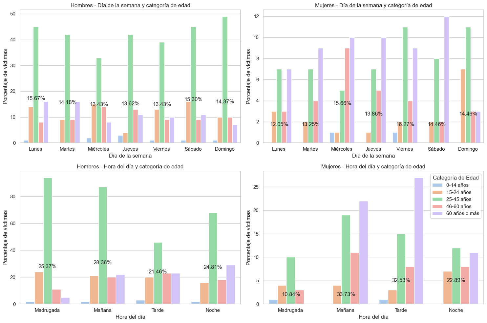

# PI2-Siniestros-Edupechav
Individual Project No. 2 for the Soy Henry Bootcamp. Ft17

Lee el [

# Analysis of Traffic Accidents in Buenos Aires City
In this project, the role of a data analyst is simulated in order to analyze traffic accidents with fatal victims in the City of Buenos Aires (CABA) between 2016 and 2021. The project simulates being carried out for the Mobility and Road Safety Observatory, which operates as part of the Transportation Secretariat of the Autonomous City of Buenos Aires Government.

# Background
Traffic accidents are one of the leading causes of violent death in Argentina. Only in Buenos Aires, hundreds of lives are lost every year. Understanding the risk factors associated with these tragedies is essential to provide information that can save lives by contributing to the improvement of urban mobility, safety policies, and even healthcare.

# Objectives
## Key Questions
Some of the questions we aim to answer through data analysis include:

- Which years/months have the highest accident rates?
- Are there hourly risk patterns?
- Which geographical areas have the most accidents?
- Demographic profile of the victims.
- What types of vehicles and infractions are prevalent in accidents with fatal victims?

## Key Performance Indicators (KPIs)
In order to provide indicators to assess progress towards specific goals that allow managing performance in relation to road safety and the reduction of fatal incidents, we present 3 KPIs. Two requested by the observatory and one generated within the framework of this analysis.

The KPIs requested by the observatory, according to the desired goals, are:

### Proposed KPIs

* **Reduce the homicide rate in traffic accidents in the last six months by 10%, in CABA, compared to the homicide rate in traffic accidents in the previous semester**

To do this, the homicide rate in traffic accidents is defined as the number of fatal victims in traffic accidents per 100,000 inhabitants in a specific geographical area during a specific period of time. Its formula is: (Number of homicides in traffic accidents / Total population) * 100,000. It is necessary to specify that, because a temporal comparison is requested, it is necessary to generate the semi-annual rate for each half of the year, so the calculation must be adjusted, and it would basically look like this: subtraction of the rate from the previous semester (victims from the previous semester / population of the previous semester) minus the rate of the current year (victims from the current semester / population of the current semester) and divide the result by the rate of the previous semester.

The necessary data comes from the described database. However, for the calculation of time differences, the total population of CABA is required, as well as the population by gender for KPI 3, which was obtained from the 2022 CENSUS. The specific file is: [Census_2022](Data%20and%20notebooks/bases/para%20powerbi/proy_1025_depto_caba.xlsx)

* **Reduce the number of fatal motorcycle accidents in the last year by 7%, in CABA, compared to the number of fatal motorcycle accidents in the previous year**

The number of fatal motorcycle accidents in traffic accidents is defined as the absolute number of fatal accidents involving victims traveling on motorcycles during a certain period of time. The formula for measuring the evolution of fatal accidents with motorcycle victims is: (Number of fatal accidents with motorcycle victims in the previous year - Number of fatal accidents with motorcycle victims in the current year) / (Number of fatal accidents with motorcycle victims in the previous year) * 100

* **Reduce the homicide rate in traffic accidents for female pedestrians in the last six months by 10%, in CABA, compared to the homicide rate in traffic accidents for female pedestrians in the previous semester**

The calculation is exactly the same as that of KPI1, with the difference that only the victims who appear as Pedestrians and Women in the database are taken into account.

# Data
The data corresponds to information about traffic accidents that occurred in the City of Buenos Aires. It includes variables such as the unique identifier of the accident, date, time, location, normalized address, geolocation, number of victims, and classification of the vehicles involved as victim and accused.

The classification variables categorize the vehicles involved into types such as car, motorcycle, bicycle, truck, pedestrian, etc. The data dictionary and the database itself can be found here: [Homicides Database](Data%20and%20notebooks/bases/homicidios.xlsx)

# Preparation
In order to perform the necessary analyses, the process of ETL (Extraction, Transformation, and Loading) of the data provided by the observatory was carried out. The process involved extracting the files, detecting and removing duplicate and null values, normalizing text strings, removing unnecessary columns, and merging dataframes with valuable information. The file with the process is [1.ETL_EDP_Siniestros](Data%20and%20notebooks/1.ETL_EDP_Siniestros.ipynb). From this, the [siniestros.parquet](Data%20and%20notebooks/bases/siniestros.parquet) database emerged, which was used to perform exploratory data analysis.

# Exploratory Data Analysis (EDA)

During this phase, general information was obtained from the dataset processed by ETL. The notebook with the code can be found here: [2.EDA_EDP](Data%20and%20notebooks/2_EDA_EDP_Final.ipynb). A more "user-friendly" version, free of code and in MD format, can be found here: [Exploratory Analysis without Code](Analisis%20exploratorio%20sin%20código.md). Below is a brief summary of the findings from this part.

First, a **statistical analysis of variables treated as numeric** was performed to obtain statistics such as mean, standard deviation, minimum, and maximum values. It was found that:

- The average number of fatal victims per accident was 1.06, with little variability around this value.
- The average age was 42 years, with moderate dispersion.
- The average incident time was around noon, with a distributed pattern throughout the day.
- The average year was 2018, with low variability due to the narrow range of the data.
- The average month and day were close to July and the 16th, respectively.

Data were also graphed to detect outliers.

After that, an **analysis of Categorical Variables** was performed, in which the top 5 categories in each variable were analyzed, and it was found that:

- There is a predominance of male victims.
- The type of road with the most accidents is Avenida.
- There are communes where more accidents occur (1, 4, 9, 8, and 7).
- Motorcyclists and pedestrians are the main victims, and the most common roles are driver and pedestrian.

## Visual Exploration
After conducting the descriptive analysis, a graphical analysis was carried out, which was divided into three parts: general graphs, a correlation matrix, and specific graphs guided by the latter. Below are the most relevant findings from this section.

### General Graphs
In the general graphs section, it was observed that **young men between 20 and 40 years old are the most affected by fatal traffic accidents**, with the peak occurring at 40 years old. In women, the highest frequency of victims is between 40 and 60 years old, suggesting different patterns in which men and women are involved in traffic accidents.

Moreover, almost all incidents involve a single victim. Incidents with more than two victims are very few, and those involving more than three are almost non-existent. It is suggested as a hypothesis that perhaps the registration of the gender of the victims is not so accurate and does not account for combinations (1 man, 2 women; 2 women, 1 man, etc.), which could hinder precise registration.

Regarding the **temporal distribution** of accidents, fluctuations without a clear pattern were observed in the number of accidents and fatalities on an annual basis, with some specific peaks such as in January and June 2017. There also appears to be a **possible influence of the pandemic lockdown**. On a monthly basis, seasonal patterns are detected, with peaks towards the end of the year that could indicate trends or specific events that increase incidents.

### Correlation Matrix
In addition to the above, a correlation matrix was created to guide further review.

As a result, some correlations were found that, although weak, provide some insights explored in the subsequent graphs.

Among them, a correlation was found:
* Negative between victims and age (-0.096), meaning that accidents with more victims may involve younger people.
* Negative between victims and hour (-0.099), suggesting that certain hours appear to be riskier and have more accidents.
* Positive correlation between age and hour (0.176) and a negative correlation between age and gender (-0.199).

### Specific Graphs

In this section, the relationship between the **Number of Victims by day, hour, and age** was explored, and it was observed that the group of **25 to 45 years old experiences more fatal incidents**, especially towards the weekend. In contrast, older individuals have more accidents during the week.

It was also found that **men have more accidents on weekends and during the early hours**, while in the case of women, they are more **exposed in the morning and afternoon, and older women are the largest group of victims in their class**.

On the other hand, exploring the **Types of Victims and Roles by Gender**, it was discovered a widespread trend of **men suffering accidents on motorcycles** and **women while walking**. The stark difference in how women experience public roads was the reason for deciding to develop a KPI based on reducing these incidents.

Finally, another valuable finding was that the time between the accident and death is **longer during weekdays**, suggesting that less severe accidents may occur during the week, allowing for extended survival time, or perhaps better medical attention is received during the week, which could be attributed to various patterns in healthcare services.

In this regard, these data were disaggregated by gender, and it was found that in **women**, the survival time is slightly shorter, with accidents distributed throughout the week and a very large peak on Sunday. While in men, they are concentrated from **Monday to Wednesday**, revealing significant contrasts.

# Power BI Dashboard

In order to offer a dynamic presentation of these findings, an interactive [dashboard](Edu_powerbi.pbix) was created in Power BI. It was created by importing the mentioned .parquet database and performing various transformations and creations within the workspace. The dashboard has 4 sections. The first one is shown below, containing the most general information about the data. It basically contains the Top No. 5 most relevant observations.

On the other hand, the 2nd and 3rd sections display spatial and temporal information, and they provide filters to obtain the most specific information possible.

Finally, the last section presents the requested KPIs with filters to explore compliance by year.

# Conclusions

Based on the analysis carried out on traffic accidents with fatal victims in CABA between 2016 and 2021, the following conclusions can be drawn:

1. The demographic profile of victims varies by gender and age, with different patterns for men and women.

2. There is a correlation between the number of victims and factors such as age and time of day, which can help identify high-risk groups and hours.

3. Motorcyclists and pedestrians are the most affected groups, with distinct patterns of involvement in accidents.

4. Survival time after an accident varies by gender and day of the week, suggesting potential differences in healthcare response and accident severity.

5. The Power BI dashboard provides an interactive tool to explore the data and monitor the progress of key performance indicators.

These findings can inform policies and interventions to improve road safety and reduce the number of fatal accidents in Buenos Aires City.
